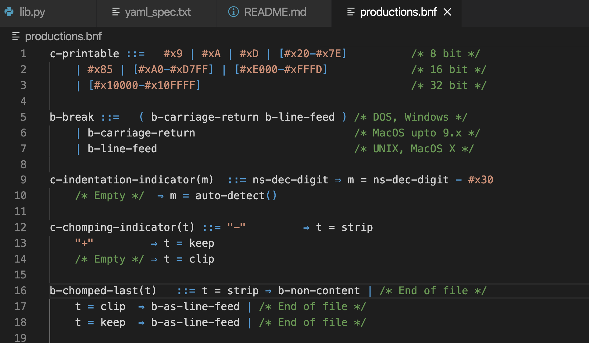

# vscode-bnf for YAML's BNF flavor

This extension adds BNF syntax highlighting to Visual Studio Code.

Files with the extension `.bnf` will automatically be highlighting.

Some differences with standard BNF grammar:

- `/* C-style comments */`

TODO new screenshot

